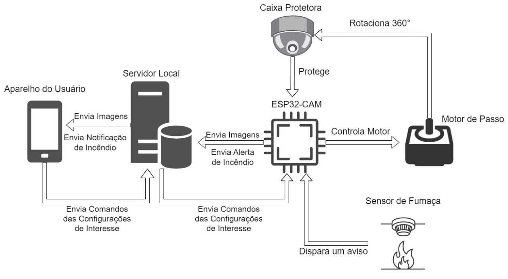

# MechCam

Este projeto foi desenvolvido no contexto da disciplina de Projeto Integrador I, do curso
de Engenharia Mecatrônica, e tem como objetivo desenvolver um protótipo de um sistema
de câmera de segurança residencial com rotação de 360° e detecção de vazamentos de gás
através de sensores. Esse sistema visa auxiliar a população a monitorar suas residências,
otimizando a tomada de decisões e reduzindo o número de acidentes domésticos causados
por vazamentos de gás.
<\p>

A arquitetura desse projeta está mostrada na figura abaixo. Nela podemos ver que a comunicação utiliza o paradigma cliente-servidor, no qual o microcontrolador e o usuário tem papel de cliente, enviando e recebendo informações do servidor.caso de existência de um gás como o GLP, um sinal é enviado pelo sensor ao microcontrolador, que, ao ser acionado, envia um alerta ao servidor local. O servidor, ao recebê-lo, envia uma notificação ao aparelho do usuário. A ESP32-CAM também é responsável pela captura de imagens e pelo seu envio ao mesmo servidor, que repassa as imagens ao aparelho do usuário. Já o motor tem seu controle feito pelo microntrolador, que recebe a rotação requisitada pelo usuário através do servidor. Essa rotação é transmitida à caixa protetora que armazena a ESP, rotacionando, assim, a câmera. Essa rotação será feita em ambos os sentidos, em até 180 graus para cada um deles, a partir de um ponto de referência pré determinado.
<\p>

Para executar o projeto, é necessário fazer o upload do sistema embarcado em um microcontrolador ESP32-CAM, e então o configurar para acessar a rede. Após isso é preciso executar o servidor NODE com o comando 'node app.js' e então acessar via navegador o localhost na porta estabelecida.
<\p>
